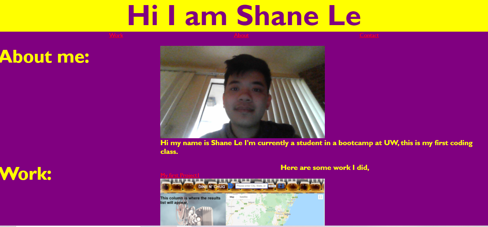

# Profesional Portfolio
## Description
This project is about me and I did this project because it taught me a lot of things espcially tags, id, class, flex, and etc. This project is useful to me in coding. It could also help me in future assignments and opportunity for future jobs. I have been resarching about CCS and HTML and people helped me.
- My motivation to do this homework was to understand more about coding and this was one of my assignment. I also want to complete something and catch up to my homework even though I'm way behind. I also want more opportunity for my future.
- I build this project because it was one of my assignment and I want to learn more about coding and getting intrested on coding.
- Made me more active in coding and learned more things about coding. My teacher (John Young) suggests me to compare one of the file to know more about the CSS and this helped me a lot how to design my project and knows more about CSS. I asked help and I got helped by my tutor too. They gave many resources to me so I can learn more about CSS and HTML.
- I learned more about HTML to organize with tags to make it organize and learned about CSS about ID and class that you could use that to design your project and how to make it look more better on your browser.
## Installation
<!-- What are the steps required to install your project? Provide a step-by-step description of how to get the development environment running. --> I post my github by doing "git add -A" then "git commit -m "" and then "git push" to github.
## Usage

## Features
There's "About Me", "Work", and my Contact. There's also picture of me, my Homework, and my first Project with my team.